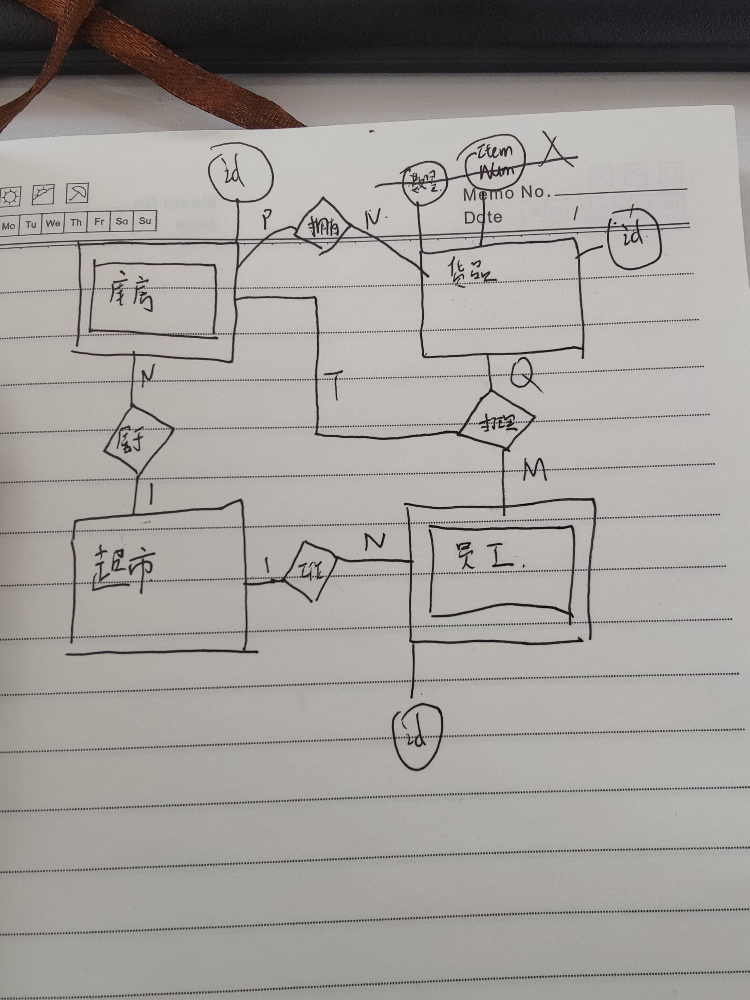

## 数据类型注意事项

Int：TINYINT 1字节；SMALLINT 2字节；MEDIUMINT 3字节；INT 4字节；BIGINT 8字节

浮点数：float 4字节；double 8字节  由于浮点数是通过二进制来表示，所以精度会有问题，在进行等号判断时需要格外注意；

定点数：将小数点 前和后 的部分拆开来分别转换成16进制存储 使用DECIMAL(M,D)的方式去定义M<=65 D表示小数点后的位数

~~浮点数表示范围大但是不精准，平时使用中decimal用的更多一些~~

DECIMAL是根据M的值动态调整它的占用空间，可以看到它的理论值要比8个字节的double 还要大，但是同时占用的空间也更多，所以当在数据范围不大的情况下，我们可以设置较小的M值保证精准计算的同时占据空间也比较少。

TEXT: 系统按照实际长度进行存储，不需要定义长度。

TINYTEXT 255字符；TEXT 65535字符；MEDIUMTEXT 2的24次方个字符;LONGTEXT 4G；

CHAR(M):定长字符串，预先定义M的值表示长度为多少 

VARCHAR(M):变长字符串，也需要定义M为最大长度

EUNM ：枚举类型，取值为预先定义的可能的结果中的一个，必须知道所有可能的结果；

 SET: 与ENUM类似，但是取值是0或多个可能的结果（相当于集合）

由于text实际存储长度不固定，无法作为主键；只能使用CHAR(M)或VARCHAR(M)

日期：

DATETIME最精准，推荐使用。 YYYY-MM-DD HH:MM:SS 1000-01-01 00:00:00 ~ 9999-12-31 23:59:59 8字节

TIMESTAMP范围相对较小

## 创建表时的约束类型

非空约束

唯一性约束 不同于主键约束，它的值可以为空；

自增约束 只有int类型可以定义为自增约束，并且手动插入值后自增基数会改变

常用的一些语句格式：

```sql
 CREATE TABLE demo.template{
 name type NOT NULL PRIMARY KEY UNIQUE AUTO_INCREMENT DEFAULT value
 }
 
 ALTER TABLE demo.template
 ADD COLUMN name type FIRST|AFTER anycolumn,
 CHANGE oldname newname type,
 MODIFY name type FIRST|AFTER anycolumn
```

注意一条alter table后如果想写多条表修改的语句，需要使用逗号隔开，不可以用分号，也不可以省略。


## 插入时的字段约束

**在修改列属性时，假设修改后与列中数据存在冲突（比如给列添加not null但是却有为null的数据)则修改会失败**

```sql
ALTER TABLE demo.goodsmaster
MODIFY specification TEXT NOT NULL
```

假如此时有一条数据的specification为null则执行失败

**sql可以插入一行不完整的数据，但是前提是为空的列要知道怎么去处理，比如可以为null，有默认值，自增，否则这种插入也会失败**

```sql
INSERT INTO TABLENAME (COLUMNS...) 
SELECT (COLUMNS...) FROM TABLENAME2
WHERE ... 
//插入同样可以插入查询结果
```

## 删除

```sql
DELETE FROM TABLENAME
WHERE ...
```

注意mysql做了一定的限制，在使用delete时where后的条件必须存在，如果想删除所有数据需要利用主键或者其他列属性来写match所有行的条件语句

## 修改

```sql
UPDATE TABLE
SET COLUMN1=VALUE1,COLUMN2=VALUE2
WHERE...
```

使用修改时尽量不要修改主键，否则容易引起不可预计的错误；

set后可以跟多条属性。

## 查询

```sql
SELECT *|COLUMNS 
FROM TABLENAME
WHERE ...
GROUP BY COLUMN1
HAVING ...
ORDER BY COLUMN2
LIMIT starter,rowsnumber
```

GROUPBY表示查询结果如何分组，经常和聚合函数一起使用；

FROM后不仅能跟表名，还可以跟关联表（暂时不关注），**派生表** 也就是将某个查询语句的结果作为一张临时表，mysql规定必须使用as

将派生表进行临时的命名。

```sql
SELECT TEMP.goodsname
FROM (SELECT * FROM demo.goodsmaster) AS TEMP
```

ORDER BY COLUMN1 DESC,COLUMN2 ASC;

orderby表示按照某种属性升序或者降序排列，可以有多个排列规则同时出现，原则是在满足了前面的规则后，将COLUMN1相同的行按照第二条规则再排列 

LIMIT head,rows;表示只想看[head,head+rows]的查询结果

## on duplicate

可以解决“如果有就更改，没有就插入的问题”

假设要做两张相似表的合并：

```sql
INSERT INTO demo.goodsmaster
(SELECT * FROM demo.goodsmaster1) as A
ON DUPLICATE KEY UPDATE barcode = A.barcode, goodsname=A.goodsname;
```

扩展：可以看到ON DUPLACATE 是作为一个描述“重复”， KEY表示“重复的字段是哪个”，理想情况下即唯一的主键（索引）

当存在多个唯一的索引时可能会有bug，所以引入了gap锁，但是gap锁又可能导致事务的死锁，具体解释在下面的链接，目前还不理解这些锁的原理，不必深入。

on duplicate的缺陷与解决办法：https://cloud.tencent.com/developer/article/1609770

insert ignore 是忽略已存在的数据，插入不存在的数据

## 主键自增不连续

思考题：可以利用count(*)是否等于max(key)-min(key)+1来判断是否有缺失的id 至于怎么找到缺失的id就有些麻烦了

https://blog.csdn.net/bfz_50/article/details/113699457

https://www.jianshu.com/p/1da3f7d73d72

这里关于id不连续自增的坑还是有点多的，以后遇到了回头看看

## 如何正确的设置主键

1，尽量不要用业务字段作为主键，因为在实际场景中字段的变化难以预料，就像例子中的 原卡主不用卡后，新卡主使用了原卡号，相关联的原卡主交易流水就被“分配”给了新卡主，这样就出现了错误；

2，如果是单一数据库可以使用自增的字段作主键；

3，如果是多个服务器对应多个数据库，自增就可能造成重复主键的问题，这个时候就要用业务逻辑来自行设置主键值


思考题：使用 以下方式（两张表进行条件匹配）灵活的进行数据库更改 （这里还没有用到JOIN）

```sql
UPDATE demo.goodsmaster AS a,demo.trans AS b
SET a.price=a.price*0.8// SET price=price*0.8 (因为这里要对ab表的price都进行修改)
WHERE a.itemnumber = b.itemnumber
AND b.unit = '包'
```

## 多表查询

### 外键

主表与从表是一种相对的关系，A与B通过A中的id字段发生关系R，那么A在关系R中就是主表，B就是从表，B中的aid引用了A中的id，aid这个字段就是外键。

外键需要创建，在创建后AB表之间就有了约束，假如要删除A中id被B中aid引用的数据，就会发生错误。

创建外键的方式：

```sql
[CONSTRAINT 外键约束名]FOREIGN KEY 字段名
REFERENCES <主表名> 字段名

//创建主表
CREATE TABLE demo.importhead (
 listnumber INT PRIMARY KEY,
 supplierid INT,
 stocknumber INT,
 importtype INT,
 importquantity DECIMAL(10 , 3 ),
 importvalue DECIMAL(10 , 2 ),
 recorder INT,
 recordingdate DATETIME
);
 
 //创建从表
CREATE TABLE demo.importdetails
(
listnumber INT,
itemnumber INT,
quantity DECIMAL(10,3),
importprice DECIMAL(10,2),
importvalue DECIMAL(10,2),
CONSTRAINT fk_detail_listnumber FOREIGN KEY (listnumber)
REFERENCES demo.importhead (listnumber)
)

ALTER TABLE demo.importdetails
ADD CONSTRAINT fk_detail_listnumber FOREIGN KEY (listnumber)
REFERENCES demo.importhead (listnumber)
//ADD 也可以用来ADD PRIMARY KEY
```

### 连接

### INNER JOIN

返回满足条件的记录（INNER JOIN = JOIN = CROSS JOIN)

```sql
SELECT
    b.cardno,
    b.membername,
    b.memberphone,
    a.transactionnumber
FROM 
demo.trans as a JOIN
demo.membermaster as b
ON (a.cardno=b.cardno)
```

会将ab表中cardno相同的记录选出

### OUTER JOIN

返回某一个表中的所有记录，同时返回满足条件的另一个表中的字段值， 否则为null?default?

```sql
SELECT
a.transactionnumber,
a.transactiontime,
a.price,
b.mermbername
FROM
demo.trans as a LEFT JOIN
demo.membermaster as b
ON(a.cardno=b.cardno)
```

会返回a表中的所有记录，如果在b中有cardno相同的就补上membername，否则为空


虽然不用外键我们也可以使用关联查询，且外键在高并发的情况下确实会有性能的影响，但是这不意味着不推荐使用外键，因为外键是一种简单的保证关联表数据正确的手段，否则我们必须通过外部业务逻辑来确保数据的正确性。

思考题：通过定义”原子操作“，将对 从表 和 主表 的操作绑定在一起，比如要删除时，我们先删除从表中外键符合条件的记录，再删除主表中对应的数据 （疑问，外键引用的必须是主键吗，满足唯一性的索引可以吗？答：不一定，但必须是唯一性索引。）


一个问题：sql的批量查询怎么写，java springboot mybatis是怎么处理的，如何解决批量 存在即更新 不存在就插入的问题

insert update是mysql特有的功能；replace into 坑很多；转换思路：先批量查询，根据结果分成两类，再对两类数据分别进行批量更新与批量插入。

## WHERE 与 HAVING

查询单笔销售超过50的“商品“

使用WHERE:

```sql
SELECT DISTINCT A.goodsname //DISTINCT(itemnumber,goodsname)
FROM (demo.goodsmaster)AS A
join (demo.transactiondetails) AS B
ON (A.itemnumber = B.itemnumber)
WHERE(B.salevalue>50)
//使用DISTINCT去除冗余
//不太确定DISTINCT后面能不能跟多个字段组成的 ”字段“ 试了一下 可以，多个字段应该就是得都相同才算作相同
```

此过程的工作流程是先通过WHERE筛选出salesvalue>50的结果，再将此筛选后的表与表A做join，最后获得联合查询的结果。

因为先where有助于缩小联合表的大小，可以增加效率


groupby + having 最终的结果似乎是 组，而不是这一组的所有数据

**group by的作用是分组，是对筛选结果的 分组、统计，最终关注的结果也是组本身，而不是每个组的数据**

~~groupby 是分组，这很直观，按照columns进行分组，之后全部展示；~~

having 不可单独出现，它是配合group by将最终的分组结果进行筛选，这个筛选的作用对象也是 组，而不是某一条数据；

且如果是关联表的情况，having是发生在连接之后，所以where的效率更高；

**where可以直接使用表中字段作为筛选条件，不可以使用分组函数，因为它发生在group by之前；having可以使用分组函数和 分组字段，其他字段不可以使用，这也说明having”筛选“的是组本身**

思考：如何用where写出group by的效果呢？暂时还想不到怎么写（可能需要业务代码去配合，总之效率会很低，且麻烦）

```sql
//包括交易时间、收银员、商品名称、销售数量、价
格和销售金额等信息，超市的经营者要查询“2020-12-10”和“2020-12-11”这两天收银金
额超过 100 元的销售日期、收银员名称、销售数量和销售金额。
//自己写的版本
SELECT b.date,c.name,count(*),count(b.salesvalue)
FROM
demo.transactionhead AS a
JOIN
demo.transactiondetails AS b ON (a.transno=b.transno)
JOIN
demo.operator AS c ON (b.opid=c.opid)
JOIN
demo.goodsmaster as d ON (b.itemnumber=d.itemnumber)
WHERE b.date='2020-12-10' | b.date='2020-12-11'
GROUP BY c.name,b.date
HAVING count(b.salesvalue)>100
//错误点
//1,求和要用SUM函数，count是计算结果行数的
//2，不需要连接商品表，因为不需要商品详细信息
//3，日期判断要用 in

//疑惑 不知道此时在select中是否可以用count(*) 可以用 就是每组的个数
SELECT b.date,c.name,SUM(b.quantity),SUM(b.salesvalue)
FROM
demo.transactionhead AS a
JOIN
demo.transactiondetails AS b ON (a.transid=b.transid)
JOIN
demo.operator AS c ON (b.opid=c.opid)
WHERE b.date IN ('2020-12-10','2020-12-11')
GROUP BY c.name,b.date
HAVING SUM(b.salesvalue)>100
//另一种条件筛选写法 不用where
HAVING SUM(b.salesvalue)>100 AND b.date IN ('2020-12-10','2020-12-11')
//不需要统计函数的条件语句可以挪到where中
```

思考题：尽管having中也可以放不使用统计函数的判断条件，但是在having中效率会降低，所以尽量将此类判断条件放入where中提高查询效率。

## 聚合函数

```sql
//咱们的项目需求是这样的：超市经营者提出，他们需要统计某个门店，每天、每个单品的销售
情况，包括销售数量和销售金额等。这里涉及 3 个数据表，具体信息如下所示：


SELECT SUM(A.salesvalue),SUM(A.quantity)
FROM
demo.transactiondetails AS A JOIN
demo.transactionhead AS B ON (A.transactionid=B.transactionid)
JOIN demo.goodsmaster AS C ON (A.itemnumber=C.itemnumber)
GROUP BY B.transdate,C.itemnumber
//缺陷：没有使用LEFT 因为date是包含分秒的，需要用LEFT将其年月日截取出来进行判断;
//没有用order by进行排序 会使得结果很混乱，且由于name和itemnumber是对应的，最后可以用name来group以显示name，否则无法
//在select中使用name


SELECT LEFT(B.transdate),C.goodsname,SUM(A.salesvalue),SUM(A.quantity)
FROM
demo.transactiondetails AS A JOIN
demo.transactionhead AS B ON (A.transactionid=B.transactionid)
JOIN demo.goodsmaster AS C ON (A.itemnumber=C.itemnumber)
GROUP BY LEFT(B.transdate),C.goodsname
ORDER BY LEFT(B.transdate),C.goodsname	

```

SUM AVG MAX MIN

理解了group by的作用机制，上述函数就都好理解了，只需要明白它们作用的是 组 就不会产生困惑。

**COUNT函数也类似，不过要注意如果COUNT(column1)，假如某一行column1为null，就不会计算这一次**

思考题：如果用户想要查询一下，在商品信息表中，到底是哪种商品的商品名称有重复，分别重复了几

次，该如何查询呢

```sql
SELECT goodsname,COUNT(*)
FROM goodsmaster
GROUP BY goodsname
HAVING COUNT(*)>1
```

## 时间函数

需求：

按照小时统计商品销售情况

```sql
SELECT HOUR(b.transdate),SUM(quantity),SUM(salesvalue)
FROM
demo.transactiondetails a
JOIN
demo.transactionhead b ON (a.transactionid = b.transactionid)
GROUP BY HOUR(b.transdate)
ORDER BY HOUR(b.transdate)
```

理解误区：每天的hour虽然是一样的，但是我们统计的是时段，本身就和 天 没有关系，所以hour相等就代表同一时段

提取的两种写法：

```sql
EXTRACT(type FROM date)
HOUR(date)
//举例
EXTRACT(HOUR FROM A.timestamp); EXTRACT(YEAR FROM A.timestamp)
HOUR(A.timestamp);YEAR(A.timestamp)
```

常用的时间计算函数:

```sql
DATE_ADD(DATE,INTERVAL 表达式 type)//将date向前或向后 type类型的 表达式时长的 日期，表达式为负表示向前
LAST_DAY(DATE)//获取DATE所在月份最后一天的日期
```

需求:

假设今天是2020 年 12 月 10 日，超市经营者提出，他们需要计算这个月单品销售金额的统计，以及与去年同期相比的增长率

```sql
//核心是通过上述两个函数获取2019-12-01与2019-12-31这两个日期
退一年-》退一个月-》最后一天-》加一天
SELECT DATE_ADD(LAST_DAY((DATE_ADD(DATE_ADD('2020-12-10',INTERVAL -1 YEAR)),INTERVAL -1 MONTH)),INTERVAL 1 DAY)
```

更多的时间函数：

假设今天是 2021 年 02 月 06 日，通过下面的代码，我们就可以查到今天商品的全部折后价

```sql
//自己的版本：
SELECT A.
FROM discountrule as A JOIN
goodsmaster as B ON A.itemnumber = B.itemnumber
WHERE weekday=DAYOFWEEK(CURDATE());
//无法解决与忽略的问题：
//1，dayofweek是以周日为1开始计算，一直到周六7，所以在日期判断上不能直接用相等，引入条件函数CASE来解决问题
//2，无法处理discount因为join查不到时为null但要将其赋为1
//3，leftjoin我是想到了，但是为什么不将日期的判断放到where中呢？准备实验一下，我觉得是相同的效果


SELECT CASE DAYOFWEEK(CURDATE()) WHEN 1 THEN 7 ELSE DAYOFWEEK(CURDATE())-1 END AS weekday,
B.goodsname,B.price,IFNULL(A.discount,1)*B.price AS discountprice
FROM discountrule as A RIGHT JOIN
goodsmaster as B ON (A.itemnumber = B.itemnumber AND 
                     A.weekday=CASE DAYOFWEEK(CURDATE()) WHEN 1 THEN 7 ELSE DAYOFWEEK(CURDATE())-1 END)

```

在写这个sql语句中遇到了很诡异的事，如果将and后的逻辑移出ON 并写入where，最后查询出的结果只有一条，顺序变成了

：on->join->where where筛选放在了联合的后面，而不是where筛选完再进行联合，至于为什么稍后专门开一小节解释。

剩下的时间函数：DATE_FORMAT(DATE,'%T') 按照一定格式显示时间；DATEDIFF(DATE1,DATE2)计算两个日期之间相差多少天，都比较好理解。

思考题：

```sql
SELECT DATE_FORMAT(CURDATE(),"%W")

```

## ON JOIN WHERE的执行顺序

在WHERE与HAVING那一节，作者说过 WHERE是在联合之前进行筛选，随后再对表进行联合；

可是当我写了LEFT JOIN的语句后发现并非如此，下面是一些思考和结论：

首先从逻辑上来说，执行顺序是完全按照SELECT的规范模板来的

```sql
SELECT FROM 
a
JOIN b ON ()
WHERE
GROUP BY
HAVING
ORDER BY
LIMIT head,length
```

如上述模板所示。首先理解ON这个条件，它其实也是一种”筛选“，只不过是将符合其中条件的 两表中的数据都留了下来，比如有一个条件a.id=b.id,就表示在表b中能找到对应的a.id的话，那么a.id对应在表a中的那一行就要被保留下来；同理对b表也做一个相同的筛选，最后再将两个筛选后的临时表进行连接。

连接这个过程比我想象中要复杂一些，如果是1对1的连接还好理解，连接后的表和两张临时表的长度是一样的，那如果出现1对多的情况要怎么连接呢？（尽管1对多在实际业务中可能并不合理，但你必须能理解这种情况是怎样的一种行为）其实就是使用”排列组合“的思想，将临时表中符合某个具体值的行全部拿出来（分为a，b两侧），将两侧的行排列组合链接就得到了该值情况下的连接结果

举个抽象的例子：a表id=1的行有2，3行；b表id=1的行有5，6行，那么我们最终对id=1的连接结果就是 2-5,2-6,3-5,3-6，这样理解就很简单了。（这里如果能画图就很直观了）

https://blog.csdn.net/muxiaoshan/article/details/7617533文中的sql1能很好的解释连接这个过程是怎么做的。

理解了join的具体原理，再解释left join就很简单，上面我们说过join是在on的筛选后进行的联合，那么left join同样如此，只不过它的左表会忽视on中的筛选条件，也就是左表的筛选后结果为全表，接下来的join就和普通的join一样，只是可能碰到一个问题，因为筛选条件的不对等，会导致某个具体的条件值在左表中有，而在右表中没有，这种时候可能就变成了1-0这种联合，解决的方案也很简单，0这一侧的行会使用NULL或者default来代替一行。

理解了上面的所有内容后，where的筛选时机就很好理解了，当普通join时，由于on中的条件是左右对等的，所以where的筛选发生在join之前或之后，结果都是一样的！（这里不会用数学或者公式证明，但是确实如此）

而left join中由于左右条件不对称，where发生在join之前就变成了对一侧筛选后再进行不对称的双侧筛选；where发生在join之后就变成了不对称的双侧筛选后再对联合结果做全部的筛选（这里确实很绕，我也没法用形象的语言解释，不过从例子中我们是可以看出差别的）

（我自己做了一个总结就是，where条件在对称时是可以从一侧传向另一侧的，也就是它同时能够约束两侧，筛选条件就变成了一致的；

而非对称时where等于被on给屏蔽了，因为on总是能输出true给强侧，那么最终的结果就显示出差异）

**最终结论：普通join时where的发生时机不影响结果，mysql为了优化效率此时会将它先于join执行；而left join与right join时，由于where的发生时机会影响结果，所以就是默认的在join后发生，mysql不会也不能对此做出优化了**

所以当使用outer join时 要特别注意筛选条件是放在on中还是where中，因为最终结果会有很大差别（时间函数最后一个例子就是如此）

## 数学计算+字符处理

```sql
FLOOR(num)向下取整
CEIL/CEILING(num)向上取整
ROUND(num,x)对num进行四舍五入,直到小数点x位（比如ROUND(3.45678)=3.46）
ABS(num)取绝对值
MOD(X,Y)取余数 -》X%Y
```

```sql
CONCAT(S1,S2,S3) 字符串拼接
CAST(表达式 AS CHAR)将表达式转换为字符串
CHAR_LENGTH(S)获取字符串长度
SPACE(n)获取一个长度为n的空格字符串
SUBSTR(S,n)取S中第n个字符开始到结尾的子串
MID(S,n,m)取S中第n个字符开始的m长的子串
TRIM(S)将左右空格去掉
LTRIM(S)只去左边空格
RTRIM(S)只去右边空格
```

**需要注意CHAR_LENGTH返回的是字符串的长度，也就是字符的个数，并不是字符的占位数（汉字会占两位，如果中英复杂岂不是会很难处理格式化？）**

```sql
IF(表达式,true的结果，false的结果)
IFNULL(data,default)如果data为null就取default
ISNULL(data)判断data是否为null
```

利用条件判断+字符处理的一个例子：

```sql
//specification可能为null,所以要做处理;要将price按照规定的7个字符展示,不足的地方要用空格填满
SELECT goodsname,
IF(ISNULL(specification),goodsname,CONCAT(goodsname,'(',specification,')')) AS 描述,
CONCAT(CAST(price AS CHAR),SPACE(7-CHAR_LENGTH(CAST(price AS CHAR))))
FROM
goodsmaster
```

**可以将函数处理后的结果作为select的结果**

思考题：不适用FLOOR函数如何实现向下取整？

使用mod取余，再用原数减去余数即可 num-MOD(num,1); num%1能得到小数点后的部分，非常巧妙。

## 索引

**思考索引与主键的关系，主键到底有什么用**

```sql
CREATE INDEX 索引名 ON TABLE 表名 字段名

ALTER TABLE 表名 ADD {INDEX | KEY} 索引名 字段

CREATE TABLE 表名
(字段名 类型,
 ....
 {INDEX | KEY} 索引名 (字段)
)

```

**在创建主键或唯一性约束时，mysql会自动创建主键索引或唯一性索引，这也是主键的一个好处（通过主键索引提升查找速度）**

```sql
//创建一个transdate索引
//注意使用(10)表示取该datetime的年月日部分作为索引，很神奇，忘了这个用法是什么原理了，是datetime专属的吗？
//LEFT(str,n)返回字符串的前n个字符，datetime(10)有点像LEFT(datetime，10),不知道datetime的本质是否也是字符串
//先记住这两种用法
CREATE INDEX index_transdate ON TABLE demo.trans (transdate(10))

//EXPLAIN关键字可以显示sql语句执行过程的详细信息
EXPLAIN SELECT * FROM demo.trans
WHERE transdate>'2012-10-10' AND transdate<'2012-10-11'

+----+-------------+-------------+------------+-------+-------------------+-------------------+---------+------+------+----------+-----------------------------------------------+
| id | select_type | table | partitions | type | possible_keys | key | key_len | ref | rows | filtered | Extra |
+----+-------------+-------------+------------+-------+-------------------+-------------------+---------+------+------+----------+-----------------------------------------------+
| 1 | SIMPLE | trans | NULL | range | index_trans | index_trans | 6 | NULL | 5411 | 10.00 | Using index condition; Using where; Using MRR |
+----+-------------+-------------+------------+-------+-------------------+-------------------+---------+------+------+----------+-----------------------------------------------+

```

需要关注的explain信息：

type : range 表示使用索引查询特定范围记录

rows：5411 表示需要读取的记录总数

possible_keys：表示可选择的所有索引

key：表示此次查询使用的索引

extra：1，使用索引  2，使用WHERE筛选   3，使用顺序磁盘读取策略

**索引的基本工作原理：**

**在没有索引时，是在原表中查找符合条件的记录；而设立索引后，先通过在索引中查找符合条件的记录，再通过指针到原表中找到此条记录，效率高的原因就是 索引本身的查找比在表中查询快(猜测：可能数据库会对索引做排序 hash等，且整张数据表的读取也要更费时间) 且通过指针访问原记录是O(1)的复杂度，可以忽略不计算**

所以索引和筛选条件是强关联的，筛选时通过有效的索引将原表筛选成符合索引筛选条件的更小的数据表，随后再进行其他条件的筛选，相当于第一步进行了优化（剪枝）

这给我们的启发就是设置索引最好设置那些经常出现在筛选条件中的字段，且当有多个索引存在时，查询过程会选取那个 最有效的索引，也就是将剪纸进行最大化，在最小的结果集中进行完整的筛选。

**组合索引**

可以将多个字段当作一个整体建立索引，使这多个字段在索引筛选时同时发挥作用，达到更高的效率

```sql
写法很简单，和单索引的形式几乎完全一样
只不过 (字段) 变成了 (字段1，字段2，....)
CREATE INDEX index_date_number ON TABLE demo.trans (transdate,itemnumber)
这样就创建了一个名为index_date_number的组合索引，它是由transdate和itemnumber组成
```

组合索引的两个原则：

1，筛选条件中必须同时出现所有的组合字段条件，否则无法生效（中断）

2，筛选条件中不能出现 范围判断，只能使用 = 的判断条件，也就是必须能够精确定位；

其实这里主要需要理解**中断与左对齐**这个概念，用一个例子说明

```sql
CREATE INDEX index_casher_itemnumber_branchnumber ON TABLE demo.trans(cashernumber,itemnumber,branchnumber)

SELECT * FROM demo.trans
where cashernumber=100 AND itemnumber =2222 AND branchnumber=222
//注意筛选条件的字段顺序要和索引申明的顺序一致，从左到右去匹配组合索引的字段顺序，当匹配失败或者有范围条件时，就会在这个条件处中断，只有中断前的筛选条件能使用组合索引，效果就会变差。范围条件会使组合索引退化成单索引？即范围条件中的字段索引
//https://segmentfault.com/a/1190000015416513
//https://cloud.tencent.com/developer/article/1704743
//这一块挺复杂的，涉及到索引的实现原理即B+树，暂时不细看。范围查找的失效先理解为它不会再向后做索引筛选;
//尽量将范围条件放在精确匹配的后面
//(col1,col2,col3)实际上会创建col1 col1_co2 col1_col2_col3三个索引;
//where col1=1 and col2=2 和 col2=2 and col1=1都会触发索引，mysql内部会对语句进行优化;
//where col2=2 也能触发索引，只不过是index而非ref的查找方式，效率低很多，没有利用索引算法
```

**索引的开销**

1，存储开销 每创建一个索引，都需要对索引进行“排序”（排序只是一种笼统的说法，其实就是要用合理的数据结构使得索引的查询速度提升，比如二叉树这种也行）后进行存储，这样才能提高单独查询索引的速度；

2，数据改变时的时间开销，当我们增删改数据时，索引列一定会发生对应的变化，且数据表中的记录所在位置可能也会发生变化，那么相对的单独存储索引的结构内部也要做相应的调整，并使得索引能够正确的指向新的数据表中对应的记录。

所以索引的代价也是不小的，在创建索引时需要思考，使得索引数量合理，而不是越多越好。

思考题：

门店编号、销售日期（年月日）、毛利 建立索引，因为要经常查询某段时间，某个门店，毛利比较高的销售情况，统计对应的商品信息

## 事务

定义：使得某组数据操作要么全部执行，要么都不执行

```sql
START TRANSACTION 或者 BEGIN (表示开始事务);
一组事务操作;
COMMIT;(提交事务)
ROLLBACK(回滚);
```

要注意事务不是一个sql语句，彼此之间都使用 ; 隔开了

事务本质上是多个数据操作的集合体，它本身只能保证原子性，也就是全做或不做；内部的子操作的正确性无法得到保证，无论是操作是否违反数据库正确性或者外部逻辑是否不合理，都可能使得事务最终的结果产生错误

通过回滚或者row_count()来保证子操作全部正确的执行

```sql
START TRANSACTION;
INSERT INTO demo.trans
VALUES(1,2,3);  //假设插入失败
SELECT ROW_COUNT();//此处rowcount会返回一个-1表示上个操作出现了错误，正常情况返回的是受到影响的行数
ROLLBACK;//我们发现出错了就直接回滚了
```

在实际应用中 存储过程会大量使用事务，因为存储过程中经常包含大量的相关联操作

**存储过程和事务好像并没有直接的关系，只不过是相互配合的“伙伴”，并不是说事务不能脱离存储过程，事务本身也能单独执行。两者的设计目的不同，事务关注原子性，隔离性，数据完整性，数据持久性这些并发过程中可能造成“错误”的原则，且本质上仍然是sql；存储过程还没讲，根据查阅它并不完全是sql，使用控制流语言和sql编写，并且经过编译存储在数据库之中**

```sql
DELIMITER //  ---修改分隔符为//，意味着在碰到//之前执行不会结束，默认情况是 ; 而由于事务中有很多语句用；隔开 需要避免提前结束
CREATE PROCEDURE demo.test()
BEGIN --- 开始程序
DECLARE EXIT HANDLER FOR SQLEXCEPTION ROLLBACK; ---定义sql发生错误时使用rollback来处理,目前记住这句就行了
START TRANSACTION;
INSERT INTO demo.mytrans VALUES (1,5);
UPDATE demo.inventory SET invquantity = invquantity - 5;
COMMIT; -- 提交事务
END
// -- 完成创建  必须手都录入//代表此创建过程结束

接下来如果想调用该存储过程：
DELIMITER ;  ---首先得把结束符从 //换回 ;
CALL demo.test(); ---这样一个存储过程就调用成功了
```

**事务的隔离性**

其实这是一个非常重要的东西，因为但凡涉及到并发的业务你都得考虑这种“并发问题”，即两个事务在交叉时间点执行，A事务的中间结果是否影响了事务B的正确执行，其实就是一种“锁”的机制。只不过这种锁目前没有实际案例，不太能真正的理解，后面会长期的关注这类问题。

MySQL 支持 4 种事务隔离等级。

1. READ UNCOMMITTED：可以读取事务中还未提交的被更改的数据。

2. READ COMMITTED：只能读取事务中已经提交的被更改的数据。

3. REPEATABLE READ：表示一个事务中，对一个数据读取的值，永远跟第一次读取的值一致，不受其他事务中数据操作的影响。这也是 MySQL 的默认选项。

4. SERIALIZABLE：表示任何一个事务，一旦对某一个数据进行了任何操作，那么，一直到这个事务结束，MySQL 都会把这个数据锁住，禁止其他事务对这个数据进行任何操作。

等级越高占用资源越高，所以尽管高等级的隔离更安全，还是不能无脑的去使用。根据查阅  在rr级别下，正常情况的select是快照读，进入事务后所有查询到的都是生成快照时的数据，不会受其他事务更改数据的影响；而select for update是当前读，也就是会读到其他事务新插入的行，这种前后范围不一致的问题被称作 幻读 问题

**关于事务锁有非常多的问题和探讨，比如不同等级的隔离都存在哪些问题，又是怎么解决的...现阶段不深入了解，放一个链接是解释RR和幻读的解决原理：https://www.cnblogs.com/jian0110/p/15080603.html 主要就是行锁与隔离锁，还有快照读与当前读，现阶段只需要知道这些概念就足够了**

## 临时表

该章整体内容还是较简单的，只需要学会临时表的写法，并且知道临时表只存在于一个连接内，连接关闭后临时表全会被删除，并且不同连接之间的临时表是完全隔离的，这对并发来说是个好处。

且临时表可以申明为 ENGINE=MEMORY 或者InnoDB 分别代表内存存储与磁盘存储，两者之间的优劣也很好解答，一是速率上的差异，一是存储持久性上的差异。

要注意临时表是会占据一部分存储空间的，且由于每个连接都有自己的副本，在高访问的情况下要小心使用该特性，更好的处理方法是将中间结果存储在业务层（服务端/客户端皆可）再由对应的业务端自行处理中间结果得到最终的数据。

本节举例的四表连接还是很有特点的，因为临时表中的数据不全，假如我们只做临时表的连接，是没法保证获取全部数据的，即使我们使用外连接。这个时候就要借助原始数据表去外连接数据不完整的临时表，这样就能把临时表的数据集中到一个结果里。

思考题：

假设有多个门店，每个门店有多台收款机，每台收款机销售多种商品，请问如何查询每个门

店、每台收款机的销售金额占所属门店的销售金额的比率呢？

```sql
CREATE TEMPORARY TABLE branchsales
SELECT branchnumber,SUM(salesvalue) as totalvalue
FROM demo.sales
GROUP BY branchnumber

CREATE TEMPORARY TABLE machinesales
SELECT branchnumber,cashiernumber,SUM(salesvalue) as totalvalue
FROM demo.sales
GROUP BY branchnumber,cashiernumber

SELECT branchnumber,cashiernumber,(a.totalvalue/b.totalvalue) AS percentage
FROM machinesales AS a 
LEFT JOIN branchsales AS b
ON(a.branchnumber=b.branchnumber)

//此处的筛选条件也可以写成
FROM machinesales as a, branchsales as b
WHERE a.branchnumber=b.branchnumber
//虽然都是对表的连接且最终结果相同，但是两种方式的工作原理不太清楚，有说where连接是直接产生ab表的笛卡尔积，之后再进行条件筛选
//而join是只产生符合条件的目标结果，这种说法不太确定真实性，且从效率上似乎没有什么区别，因为在做连接时on中的筛选条件和where中
//的筛选条件做的是同一件事，比较疑惑。
//https://www.cnblogs.com/Transkai/p/13414146.html
//最终我还是认同这种说法：在做内连接时 where 和 join on 的筛选结果是相同的，且因为内部mysql的优化效率也几乎没有差距
//而使用外连接时on和where的数据过滤是完全不同的时机，所以也没有太大的可比性，就不纠结了
```

真是令人无语！因为一个typo浪费了我至少半小时！

## 视图

视图和临时表其实解决的问题是一致的，就是将复杂的查询语句进行拆分，将其中的子查询结果以不同的方式“临时”存储下来，只不过这两者分别采用了不同的方式。

临时表是真实存在的表，在连接未关闭之前，它和其他正常表没有区别，连接关闭就被删除。

而视图是虚拟表，它并不真的执行查询结果并将结果存储，它存储的是该 执行过程，就像一个函数一样，当我们利用视图查询时就等于先调用了视图中的查询语句，再对此结果做进一步的筛选。

这样做有一些好处：

1，节省空间，一条语句占据的空间当然要比临时表的结果小多了；

2，简化查询，这也是肯定的，毕竟这就是视图存在的目的，拆分大查询为多个子查询，方便调用；（其实有点面向对象中 抽象 的概念）

3，隔离用户与原数据表，使得用户调用视图来完成操作，只要保证了视图的正确性，整个过程就更加的安全。

4，数据结构相对独立，原表结构发生改变，我们也可以通过修改视图结果集让他不影响到用户（其实这点有些牵强，因为即使不用视图，我们更改对应的查询语句也能完成对应的任务，改变是不可避免的，只是发生的位置不同，一个是在视图层更改，相当于对用户屏蔽；一个是用户需要自行进行更改---》如果要举例来说的话，大概就是java业务端我们要修改sql语句，以此来应对表结构的变化，而通过视图我们java端可能完全不需要修改，只修改视图就好。也就是可以理解成把业务层的东西抽到了数据层，但是这样子合理吗，从上往下的抽象是正确的吗？）

不过也需要注意，就像我们可以真实的更改临时表一样（插入数据，更改表结构等），我们也可以“虚拟”的更改视图，只不过因为这是一张虚拟表，所以所有的更改其实是直接作用于真实表来达到的，这也就添加了一个约束：我们的视图必须字段和真实表完全一致，才可以进行插入数据，因为我们的视图常常包含了多表的联合以及一些关键字（distinct）操作，也就是虚拟表的结果和原数据表（可能都是多张）的结构相差甚远，当我们通过结果去反推源头并通过更改源头来改变结果，这个过程往往非常的复杂或者说充满了歧义（因为你不知道怎样才是正确的反推过程），所以即便update delete 操作没有这么多的限制，我们还是尽量少对视图做更改，避免最终对原数据表产生你无法理解的数据错误。

对于view的操作与对真实table的操作几乎没差别，只需要把关键字table换成view即可执行相应的alter,drop,describe等。

其余的增删改查只需要将视图看成一个虚拟表，语句和正常表没有区别(只是我们不推荐你做除了查询以外的操作)

思考题：

视图返回的结果集包括：当前时间可以卖的门票名称和剩余数量（说明：开门前 30 分钟开始售票，结束前 30 分钟停止售票）

```sql
CREATE VIEW demo.current_ticket AS
SELECT a.tname,a.balance
FROM demo.tickets_info a JOIN
demo.types_info b
ON(a.typeid=b.typeid)
WHERE(a.balance>0 AND NOW() BETWEEN (date_add(b.opentime,INTERVAL -30 MINUTE),date_add(b.closetime,INTERVAL -30 MINUTE))
```

currdate()获取的是当前的日期；now()获取的是当前具体详细时间

通过date_add(date,interval number unit)来进行时间的加减

**IN并不是范围判断，而是指可选值 COLUMN1 IN (VALUE1,VALUE2....) 即column如果是in中集合的值是便符合结果；范围判断要使用BETWEEN**

## 存储过程

存储过程有参数这个概念，不同于普通的sql，我们都需要在业务层将一条语句中的筛选条件确定，然后通过jdbc连接数据库直接执行，该语句是“写死”的；而存储过程由于有参数，我们在业务层可以动态的设置参数，在连接获得call之后，直接调用call.excute就行了，且调用之后我们可以得到out类型参数的新值，就像一个函数的返回值一样

https://www.cnblogs.com/lihaoyang/p/8675351.html 文中有一个java调用存储过程的例子，简单易懂

需要注意调用存储过程的语句本身也是sql：CALL procedure1(param1....)  java层通过一个连接+该sql获取一个call对象，并使用这个call对象来配置参数并进行真实的调用。

JDBC看来还是得系统的学一下，尽管spring架设在其之上，隐藏了这些实现，不懂的话用起来还是有点吃力

参数类型：

in:入参，也就是可读取的参数（不太清楚改变它的值是否合法，但是一定没有好处，所以不要做这种操作）

out :输出的参数，存储过程执行中可以改变它的值，在存储过程执行结束后可以被调用者使用

inout:既可以做入参也可以做出参

存储过程中可以定义变量，使用：DECLARE name type来申明；对变量赋值使用SET关键字;删除存储过程使用 DROP PROCEDURE XXX；修改存储过程有些麻烦，一般需要使用对应的数据库管理软件（workbench等），使用sql语句只能将它删除再重新写

课程中的案例:

```sql
DELIMITER //
CREATE PROCEDURE dailystaticsOP(IN transdate TEXT)
BEGIN


DECLARE startdate,enddate DATETIME;
SET startdate = date_format(transdate,'%Y-%m-%d');
SET enddate = date_add(startdate,INTERVAL 1 DAY);


DELETE FROM demo.dailystatistics
WHERE salesdate=startdate;

INSERT into dailystatistics -- 将计算结果插入每日统计表
(
salesdate,
itemnumber,
quantity,
actualvalue,
cost,
profit,
profitratio
)
SELECT b.transdate,a.itemnumber,SUM(a.quantity),SUM(a.salesvalue),SUM(a.quantity*c.cost)，SUM(a.salesvalue-a.quantity*c.cost),CASE SUM(a.salesvalue) WHEN 0 THEN 0 ELSE round(sum(a.salesvaluea.quantity*c.avgimportprice)/sum(a.salesvalue),4) 
FROM
demo.transactiondetails a JOIN
demo.transactionhead b ON(a.transactionid=b.transactionid) JOIN
demo.goodsmaster c ON(a.itemnumber=c.itemnumber)
WHERE b.transdate>startdate AND b.transdate<enddate
GROUP BY(b.transdate,a.itemnumber)
ORDER BY(b.transdate,a.itemnumber) 
END
//
DELIMITER ;


```

非常巧妙的一个点，在select中我们是无法单独拿到cost这一列的，因为我们是根据itemnumber和date分的组。但是在sum中就可以访问到该列，我们通过计算每一行的成本总数，作为一个新的“临时列”，然后使用SUM函数相加就解决了这个问题

在计算毛利时也是用的这个思想，先计算一行的毛利，再全部加起来得到总共的毛利（不过我分成两个sum是不是也可以）

思考题：

```sql
DELIMITER //
CREATE PROCEDURE changeb(IN a INT,OUT b INT)
BEGIN
SET b=a+1;
END
//
DELIMITER ;

```

## 游标

游标就像我们在编程中使用的for each 中的index下标一样，帮助我们定位 查询结果集中的每一条数据，使我们可以分别拿到每一行 再做出对应的操作。

局限性：只能在存储过程和存储函数中使用  （存储函数没做过多的了解）且似乎不能控制游标的初始值，结束条件，它会遍历结果集中的每一条记录，所以如果我们想做一定程度的控制，就要select出正确的结果集，并在执行语句中加入一些逻辑判断控制整个流程（个人理解，或许这些更应该放在业务层，sql只做统一的处理更好）

```sql
DECLARE cursor_name CURSOR FOR 结果集; //针对某个结果集定义游标

OPEN cursor_name; //打开该游标

FETCH cursor_name INTO 变量列表; //将游标指向的行的数据写入变量列表中，列数与变量数必须完全一致，且类型需要一一对应

CLOSE cursor_name;
```

在使用游标时我们需要循环，所以引入了条件处理语句和流程控制语句

### 条件处理语句

```sql
DECLARE CONTINUE | EXIT HANDLER FOR 问题 操作;
// CONTINUE 表示遇到问题后执行操作后继续执行存储过程  EXIT表示执行操作后退出当前的存储过程
//常见问题：NOT FOUND 游标走到最后，找不到结果;  SQLEXCEPTION 执行sql时发生错误;
//文中定义的操作: SET done = TRUE 通过将循环是否退出的标志设为true来退出循环
```

### 流程控制语句

```sql
//循环语句:
标签:LOOP
操作
END LOOP 标签; //使用LOOP无法自主跳出循环,必须在内部通过逻辑判断使用LEAVE或ITERATE。
//LEAVE 可用在循环或者BEGIN END包裹的过程中，根据当前所在的scope, 跳出循环或当前的程序体 有点像break
//ITERATE只能用在循环中，表示重新开始循环 有点像continue

//先判断再执行
WHILE 条件 DO
操作
END WHILE

//先执行再判断
REPEAT
操作
UNTIL 条件 END REPEAT

//IF判断
IF 表达式 THEN 操作
[ELSEIF 表达式2 THEN 操作2]...
[ELSE 操作N]
END IF

//CASE判断
CASE 表达式 WHEN 条件1 THEN 操作1 
[WHEN 条件n THEN 操作n...]
[ELSE 操作..]
END CASE

```

游标配合循环的技巧:

```sql
DECLARE CONTINUE HANDLER FOR NOT FOUND SET 条件=true;
FETCH cursor_name INTO ...;
REPEAT
操作
FETCH cursor_name INTO ...;
UNTIL 条件 END REPEAT;

//虽然上述语句写了两次fetch，但是保证了再NOT FOUND触发后都能及时的判断到条件语句，使得存储过程立即跳出循环继续下面的关闭操作
```

思考题:

```sql
DELIMITER //
CREATE PROCEDURE demo.usecursor
BEGIN
DECLARE tid INT;
DECLARE	tquant INT;
DECLARE DONE INT DEFAULT FALSE;
DECLARE index_cursor CURSOR FOR
SELECT id,Myquant
FROM demo.test;
DECLARE CONTINUE HANDLER FOR NOT FOUND SET DONE = TRUE;
OPEN index_cursor;
FETCH index_cursor INTO tid,tquant;
REPEAT
SET tquant=tquant+ IF tid mod 2 =0 THEN 1 ELSE 2;//不太确定这样写行不行 应该是行的
UPDATE demo.test as a
SET a.Myquant=tquant
WHERE a.id = tid;
FETCH index_cursor INTO tid,tquant;
UNTIL DONE END UNTIL;
CLOSE index_cursor;


END
//
DELIMITER ;

```

## 触发器

BEFORE与AFTER的区别：使用BEFORE时可以在语句中修改NEW的值（即触发条件所产生的结果)  我猜测为了实现这种操作，数据库会对触发条件语句执行后的结果进行 临时的保存，在触发器语句执行后将最终的结果再更新，所以会比AFTER多一些开销，没有特殊需求还是使用AFTER （至少在结果上这两个关键字是一致的，且它们都符合 触发条件和触发器 同时成功或同时失败的特性）

思考题：

当操作人员更新进货单明细表中相关数据的时候，自动触发对进货单头表中相关数据的更改，确保数据的一致性

```sql
CREATE TRIGGER modify_importhead BEFORE UPDATE 
ON demo.importdetails FOR EACH ROW
BEGIN
IF (OLD.importvalue<>NEW.importvalue) THEN
UPDATE demo.importhead as a
SET a.importvalue=IFNULL(a.importvalue,0)+NEW.importvalue-OLD.importvalue
WHERE a.listnumber = NEW.listnumber;
//明细表的value并不是总价值，因为一次进货可能有多种商品，所以需要算差值;且要注意头表中importvalue如果为null的情况
//专栏中作者创建触发器还是使用了delimiter,但是整个语句只有一个 ; 我觉得似乎没必要这样做 
//除非触发器语句可以是多条sql语句（应该是可以多条，因为它内部也使用了BEGIN END的标签，像是一个过程)
```

tips:

触发器和事务面向的场景有些相似，都是为了解决ACID问题

但是由于触发器难以维护，移植，调试 且 对资源的消耗，一般来说不推荐使用触发器。

https://segmentfault.com/q/1010000004907411 

https://segmentfault.com/q/1010000008704337

关于事务，存储过程，触发器优劣的讨论 得出的结论是对于数据的控制等最好还是将权力上移到业务层（触发器和存储过程都少用），而不要依赖数据库来做。主要是从维护，移植这些角度去考虑，效率上并没有很大区别

## 权限管理

角色 (ROLE):每一类角色有着自己对应的权限

横向权限:角色对哪些表有权限;

纵向权限:角色对某一张表有哪些权限(select、update、insert、delete)  不太清楚alter table之类的权限是否可以定义 （查了一下至少drop也是可以授权的，授权后可以删除表）

用户:每个用户是某一种角色，它拥有该角色对应的权限

```sql
CREATE ROLE 'xxx'@'localhost';//创建xxx的角色，且该角色只能在 该数据库所运行的服务器上登陆;不写@就表示可以在任意一台主机登录

GRANT SELECT,UPDATE ON TABLE_NAME TO 'XXX';//将在某张表上的对应权限赋予给角色XXX

SHOW GRANTS FOR 'XXX'; //查看XXX有哪些权限

DROP ROLE 'XXX'; //删除角色XXX

CREATE USER 'XXX' IDENTIFIED BY 'PASSWORD'; //创建一个由password验证的xxx用户，密码非必选项，但是最好始终都设置一个密码

GRANT 'ROLEXXX' TO 'USERXXX';//将角色xxx赋予给用户xxx

GRANT SELECT,DELETE ON TABLENAME TO 'USERXXX';//也可以直接使用权限赋值的语法

SHOW GRANTS FOR 'USERXXX';//查询用户xxx的权限

REVOKE SELECT ON TABLENAME FROM 'ROLEXXX';//将角色xxx对table的读权限撤回

REVOKE 'ROLEXXX' FROM 'USERXXX';//将用户xxx的 角色xxx权限撤回

//但是只通过创建，授权的话，用户也不会真的有权限，还必须执行下面的语句
set global active_all_roles_on_login = on;
//表示在登录时激活所有的角色，从而获得权限
```

可以的话不要将 权限控制放在业务层，并总是使用ROOT超级用户来访问数据库，一旦root的密码泄露将非常危险

尽量利用数据库自带的权限机制来做 用户权限控制（不过感觉这样子成本也很大，每创建一个表就要grant相应的权限，是一件有点麻烦的事情，且后期在维护权限列表时也很耗时间，有利有弊）


思考题:

```sql
CREATE ROLE 'accountant'@'localhost';
GRANT SELECT ON demo.goodsmaster TO 'accountant';
GRANT SELECT ON demo.settlement TO 'accountant';
GRANT SELECT,UPDATE,INSERT,DELETE ON demo.invcount TO 'accountant';
CREATE USER 'lisi' IDENTIFIED BY 'password';
GRANT 'accountant' to 'lisi';
set global active_all_roles_on_login = on;
```

理解用户与连接：

一个用户可以同时有多个连接（连接指物理上的网络连接）来并发处理客户端的请求（此处的客户端是相对于数据库的，其实是我们的JAVA业务层）

会话：逻辑上的客户端与数据库的一次交互记录，记录了本次交互的上下文相关信息（客户端机器，通过哪个程序，使用哪个用户登录）

会话可以没有连接（准备好时再创建真正的连接），一个连接可以对应多个会话 （会话串行的在一个连接上执行），会话之间互不影响

mysql的线程池与连接数的结构演变：https://segmentfault.com/q/1010000005624529

从一开始的一个连接对应一个线程（线程会伴随着连接的到来不断重新创建，释放，性能损耗与内存抖动会比较严重）到普通线程池（仍然是一对一），如果在连接数较高的情况下，总线程数会过多，频繁的上下文切换以及线程本身所占据的资源也会拖垮服务器；最后采用线程池+一对多的机制（一个线程处理多个连接的请求，以statement为单位，也就是执行语句）

最终的总结：mysql在较新的版本中才引入了线程池的机制，之前默认的连接处理机制就是one thread per connection，这种情况下很容易理解为何不能将max-connection设置过大，因为会导致线程数过多，需要频繁切换上下文，且维护线程与连接本身也需要消耗内存资源，所以当达到一个阈值时mysql服务器的响应能力会跳跃式的下滑；而即便是引入了线程池，也并不代表就解决了这个问题，因为线程池在调度分配连接时也依然要损耗时间，维护连接的资源也不容小觑，且连接过多时，如果没有足够的线程去处理，最终还是会造成串行的阻塞，不过这本质上是硬件处理能力跟不上所导致的，想要解决该问题只能提升硬件水平或者使用分布式？

活跃连接，连接数 通过设置对应线程为sleep状态来控制当前的活跃连接数，也是一种调整mysql运行效率的策略

这些数值的调整需要根据具体的硬件水平与并发量进行调整，找到一个合适的值，太低（可能造成cpu空闲时间太久浪费了硬件）或太高都不好，一般是通过压测等手段不断的去进行优化。

https://spike.dev/2020/07/26/db-max_connections-%E7%9C%9F%E7%9A%84%E8%B6%8A%E5%A4%A7%E8%B6%8A%E5%A5%BD%E5%90%97/


## 数据库日志

通用查询日志：记录所有用户连接开始和截至时间，以及在连接中发给服务器的所有sql指令。

```sql
SHOW VARIABLES LIKE '%general%';//通过该命令查看所有名称包含 general 字符的变量
SET GLOBAL general_log = 'ON';
SET @@global.general_log_file='E:\SAM\SQLLOG\general.log'
```

general_log (off/on):表示通用查询日志是否开启

general_log_file:通用查询日志的路径与名称

通用查询日志会记录所有记录，所以占据磁盘空间很大，如果使用需要定期删除旧的，再记录新的，防止它无限增大。


慢查询日志：记录执行时间超过指定时长的查询。

通过mysql安装路径下的my.ini配置：

slow-query-log=1 -开启慢查日志

slow-query-log-file=“”慢查日志位置

long-query-time=10 超过多少时间为慢查

需要配合一个变量：min_examined_row_limit 查询扫描过的最小记录数，执行语句扫描过的记录数需要大于该值且超过时间才算作慢查


错误日志：记录数据库故障信息等。

通过在my.ini文件中的 log-error=“”进行配置


二进制日志：记录数据库的更新事件，可以利用备份数据库+二进制文件来进行数据库的全量恢复。

二进制日志可以有多个，数据库目前正在使用的是当前二进制日志，通过指定新的二进制日志方便每一阶段的管理与维护

```sql
SHOW MASTER STATUS;//查看当前正在使用的二进制日志位置与名称
SHOW BINARY LOGS;//查看所有的二进制日志
SHOW BINLOG EVENTS IN 日志文件名;//查看某个日志中的所有更新事件
FLUSH BINARY LOGS;//关闭当前的二进制日志，以之前名字+1创建一个新的，并使用它
mysqlbinlog -start-position=xxx --stop-position=yyy 二进制文件名|mysql -u 用户 -p 密码 //执行从xxx开始到yyy的所有操作
RESET MASTER;//删除所有二进制日志
mysqldump -u 用户 -p 密码 数据库>备份文件.sql //将数据库全量备份到文件中
mysql -u 用户 -p 密码 数据库<备份文件.sql //将数据库从备份文件中恢复
```


中继日志：只有主从服务器架构中才有，存在于从服务器中，读取主服务器的二进制日志写进中继日志，随后从服务器读取中继日志并执行其中的更新操作使得从服务器数据与主服务器同步。


回滚日志：undo 主要用于事务回滚，通过记录事务中每次数据更新前的状态，来数据库能恢复到指定位置。同时这一机制也实现了RR隔离，使得不同事务读取到的总是事务内更改之前的值。


重做日志：redo ~~~回滚是回到发生错误之前的状态，而重做就是重新做一遍，从而修复未被完成的数据~~~

应用于两种场景：

1，事务中因为某种故障导致事务没有完整的执行，未完成的事务更改了数据，需要将数据恢复到更改前。（这不是和回滚是一样的吗，感觉很困惑）

2，mysql为了提高数据存取效率，不会每次执行语句都真实将结果写入磁盘，会先保存在内存中，等到结果到了一定的容量再一次性写入磁盘。这样如果碰到断电等情况数据就会丢失，那么就可以利用重做日志，将这些操作重做一次来恢复数据。

## 数据备份

数据备份分为物理备份和逻辑备份，物理备份是真实的将数据库中的数据“拷贝”一份，需要收费，用的较少；逻辑备份则是将需要备份的表，库，整个服务器 数据 转化为sql语句，通过再次执行这个语句实现数据的“导入”

逻辑备份常用命令：

```sql
表（表可以是多个)备份:
mysqldump -h 服务器(默认为localhost) -u 用户 -p 密码 数据库名称 表名称 > xxx.sql

库备份:
mysqldump -h 服务器 -u 用户 -p 密码 --datebases 数据库名称 ... > xxx.sql

整个mysql备份:
mysqldump -h 服务器 -u 用户 -p 密码 --all-datebases > xxx.sql
```

其中对于整个mysql服务器的备份用的很少，因为它会将系统的数据库也备份下来，消耗资源很大，没有必要


逻辑恢复：

```sql
将某张表恢复到具体库：
mysql -u 用户 -p 密码  库名称< xxx.sql

如果是恢复某个数据库则不需要指定对应的库名称

还可以使用SOURCE命令恢复，Source是mysql中的语句，而不在命令行里，需要注意。
SOURCE XXX.SQL
注意如果是恢复具体的表，需要先USE xxx 使用对应的数据库，否则可能会恢复错误
```


表的导入和导出：

```sql
如果我们想将表中的数据导出到外部物理文件，或者反过来将数据导入一张表，可以使用下面的语句：

将查询结果写入文件中，并且字段之间使用字符1(常用 ， 空格 等)隔开 行与行之间使用字符2(常用 \n)隔开
SELECT 字段列表 INTO OUTFILE 文件名
FIELDS TERMINATED BY 字符1
LINES TERMINATED BY 字符2
FROM 表名;
//导出数据时注意my.ini中的secure-file-priv参数，它规定导出的文件只能在此路径下，所以要么将文件放在该目录下，要么修改此参数去适应文件本身的路径


将文件中的数据导入表中
LOAD DATA INFILE 文件名
INTO TABLE 表名
FIELDS TERMINATED BY 字符1
LINES TERMINATED BY 字符2;

LOAD DATA速度非常快，推荐使用

```

## 范式

范式的意义是通过合理的表格设计消除数据的冗余

范式1：

一个表中的每一列都不可以再被拆分，必须都是基础的数据类型，结合到专栏中的例子就是  一本16寸的书  如果使用(16寸/本) 来记录的话就不符合规范，应该拆成 (16寸)   (本) 两个字段来记录


范式2：

表中必须有主键，且主键外的列必须完全依赖主键，而不可以依赖主键的一部分

范式2主要针对的是当我们创建复合主键时，主键外的列的数据应该完全由该联合主键确定，而不能只由复合主键中的某个或某些列确定，否则就需要拆分。专栏中的例子为 listnumber+barcode 作为一次进货的主键，但是表中的goodsname却依赖的是barcode，所以需要将只依赖barcode的这些列拆到另一个表中，再评审barcode是否可以单独作为主键，如果不行就再加一个自增主键，随后在原表中设置外键将两个表“联系”起来。


范式3：

主键外的列不可以依赖除了主键外的其他列

其实和范式2的本质是一样的，即列必须完全依赖主键，其余字段均不可以。专栏中的 suppliername就依赖于supplierid，所以要拆分出去。 （范式是顺序来进行判定的，即范式1->范式2->范式3 在满足了前置条件下再去考虑下一个范式 扩展：bnfc范式，范式4，范式5 暂时不做了解）

tips：专栏中 进货总价=单价*进货数 但是却没有将总价给去掉，看起来是一种冗余，但其实是有业务层次的考虑。因为我们的数据精度是有限的，通过数学计算无法通过任意两个值完全的还原另一个值，尽管单次交易的误差可能很小只有几分钱，但是当数据量大起来之后就会造成较大的误差，这是不可接受的。所以有时我们必须接受一定程度的冗余保存数据库数据的正确性。

思考题：

1，字段都是不可拆分的，原表满足范式1；

2，单个表中字段或复合字段都不适合做主键，所以单独建立一列id作为主键，此时满足范式2

3，goodsname和price依赖于itemnumber，单独拆分；cardno可由id确定，不拆分；salesvalue考虑到精度问题，不拆分（尽管专栏答案将salesvalue省略了)

id  transactionno  itemnumber  quantity  salesvalue  cardno      |        itemnumber goodsname price      ~~transactionno cardno~~


### 联合主键与复合主键

复合主键：将一个表中的多个字段作为一组数据，建立主键。也是我以前理解的复合主键

联合主键：将多个表的主键放在一张表中，使得多张表的数据能产生关联 （作用有点像外键）


## ER模型

ER中包含了哪些角色：强实体（不依赖其他实体），弱实体（依赖其他实体），属性，关系

关系：1对1，1对多，多对多

关系也可以由多个实体参与，比如：某员工在某仓库打点了某种商品，这就是三个实体

属性的提取：实体中的属性必须是只依赖于该实体，而不能是由某个关系衍生出来的。以思考题为例子，我将库存数量作为一个商品属性，但这并不是商品本身所具有的，而是某库房有多少某商品，即该属性应该属于   库房---商品 这个关系，而不应该属于某个实体。

同样的  盘存数量，结存数量也是属于  库房--商品---员工  这个“打理” 关系。理解这一点很重要，因为在将ER转化为数据库表时我们需要遵循以下的原则，这里提到的就是原则2，所以我们必须能提炼出中间表到底有哪些属性，否则就没法创建这种关系表。

1，实体转为一张表

2，**多对多的关系转为一张中间表**

3，一对一或一对多的关系使用外键连接；

4，属性转为表中的字段；

记住，在将ER模型转换为表后，我们仍需按照3范式再去审查表，ER图并不能保证表格之间满足3范式。

思考题：



## 查询慢怎么办

1,使用Explain等查询结果审查语句，去看查询语句的执行过程发生了什么，主要关注点 可用索引，使用的索引 key，扫描行总数 rows，

表是如何连接的 type。

其实目前来说，在分析结果后，比较有用的措施就是根据查询条件建立适当的索引，并没有能力做别的优化（或者就是优化表的整体结构，为了效率而牺牲一些空间，也就是冗余存储一部分数据等）

2，在使用通配符'%xx%'和关键字OR时需要特别小心，通配符在前的条件'%xx'是没法使用索引的（这也很好理解，等于高位完全不确定，相当于是全部数据），只有通配符在后面'xx%'可以使用索引

3，OR关键字的前后条件所使用的字段必须同时都能使用索引时这个或语句在执行时在可以使用索引

如WHERE a=10 OR b LIKE '%TT' 必须a,b列都建立了索引且条件语句都能使用索引才可以。此例中b LIKE '%TT'就不能使用索引，那么此时WHERE语句完全无法使用索引。还需要知道的一点是当能使用索引时，最终使用的是merge_key合并索引，只做了解即可。

事实上，join和子查询都是不推荐频繁使用的，子查询由于是生成临时表，这种转换很耗时；

join的性能也并不高，因为它要对两个表的数据进行比较（假设没索引的情况下就是逐条比较，嵌套循环），这种情况下不可能采用一条一条读的形式来比对数据，都是读取表的一块到一个buffer中，直接在内存中进行这一块的比较，所以一方面这个buffer有一定的内存损耗，一方面buffer的大小限制了这个比较的速率，且即便是采用了这个机制，被连接的表的数据比对这一操作都是要做的，如果没有合适的索引、算法，性能损耗必然不可忽视。而且在连接过程中，所有表都相当于被“锁住”了（并发问题，不太清晰，大致概括一下），对其他的业务也会有影响。

**原则就是尽量简单化查询语句，DB往往是业务瓶颈，所以最好是只把它作为一个数据的存储部件，不要在其中掺杂过多的业务与复杂操作。多用单表查询，再在业务层去筛选这些结果；适当的去“冗余”数据库，即便会破坏三范式，但是可以避免不必要的join；建立合适的索引，提升查找速度**

为什么不推荐用join：

https://segmentfault.com/a/1190000039731872

https://juejin.cn/post/7001492588574277663#heading-3

思考题：

```sql
SELECT * FROM demo.trans
WHERE itemnumber IN
(
SELECT itemnumber FROM demo.goodsmaster
WHERE goodsname LIKE '%书%'
);

---》

SELECT a.* FROM demo.trans a join
demo.goodsmaster b ON a.itemnumber=b.itemnumber
WHERE b.goodsname LIKE '%书%'
```

#### select_type

SIMPLE：表示简单查询，不包含子查询和联合查询。

PRIMARY：表示是最外层的查询。

UNION：表示联合查询中的第二个或者之后的查询。

DEPENDENTUNION：表示联合查询中的第二个或者之后的查询，而且这个查询受外查询的影响

两个例子：

```sql
SELECT *
FROM demo.goodsmaster a
WHERE itemnumber in
(
SELECT b.itemnumber
FROM demo.goodsmaster b
WHERE b.goodsname = '书'
UNION
SELECTc.itemnumber
FROM demo.goodsmaster c
WHERE c.goodsname = '笔'
);


--->优化为

SELECT *
FROM demo.goodsmaster a
WHERE EXISTS
(
SELECT b.id
FROM demo.goodsmaster b
WHERE b.goodsname = '书' AND a.itemnumber=b.itemnumber
UNION
SELECT c.id
FROM demo.goodsmaster c
WHERE c.goodsname = '笔' AND a.itemnumber=c.itemnumber
);

//其中
SELECT c.id
FROM demo.goodsmaster c
WHERE c.goodsname = '笔' AND a.itemnumber=c.itemnumber
//是子查询中的联合查询的第二个，且因为a.itemnumber=c.itemnumber是外部查询相关条件，所以这部分为DEPENDENTUNION
```

UNION：将两个结果集竖向合并，很好理解

IN：表示字段可取值为一个集合(value1 value2....)，也可以是一个查询结果；

EXISTS：表示查询子句如果有记录就返回true，没有就返回false （上述例子中使用了UNION,那么就等同于一个或，即前后子查询中任意一个符合条件时就返回true，表示table a的该条数据可以放进筛选结果）

NOT EXISTS就是取反

## 表太大怎么办

切入点：当数据量过大时，从竖向我们其实没有办法做什么优化，这是业务需求决定的，所以本节的切入点是横向对列也就是表的字段进行优化来缩小或者扩大表的体积，最终目的是使得数据库操作效率更高，而不是单纯的减少存储空间。

前置知识：上一章提到过数据库在操作数据时以页为单位将数据读入内存，当这个内存值为一个固定值时，一次性能读入的数据量就=

（mem）/（rows*rowmem） 其中rowmem为一行所占的空间大小，也就是根据实际数据结合列的数据类型计算。那么当我们把INT类的数据换成MEDIUMINT时就减小了该字段25%的存储空间；BIGINT代替TEXT时也能节约接近50%的空间（因为BIGINT占8个字节，而TEXT类型数据为实际长度+2个字节，假如用它表示一个18位的数字类型数据那么就占20个字节） 

即当我们能保证业务数据不会超过我们的字段类型范围时，我们应该尽可能的设定小的数据类型，使得数据库在处理数据时一次能读取更多的数据，来提升速度

合理冗余字段：上一章已经讲过这个，它虽然会一定程度上增加列数，但是可以有效的减少表的联合查询，需要在两者之间权衡。

遵循两个原则：1，该字段不会经常更改（因为更改此字段需要级联的去更改所有其他表中冗余的该字段，麻烦且容易出错）2，该字段在业务中不可或缺使得我们必须通过联合表才能获取（因为冗余会造成存储空间上升，能不用当然还是不用）

拆分表：和冗余刚好相反，有时我们会频繁的访问一张大表中的一部分数据，而不关心其他数据，此时我们将这部分频繁访问的列拆分出去单独形成一个表，就可以在访问时访问更少的总列数，提升速度。其实这也是一种冗余，因为我们不可避免的会将id冗余；且假设我们要做全表查询时不得不使用join，所以这些优化都是根据具体业务来做适配，没有完美的答案。

设立非空约束：可以省去判空的开销；不需要1bit来表示是否为NULL，也节省了一点点空间 (当然代价是业务层上要保证数据的正确性，不过将这部分“压力”从数据库中抽出放入业务层是合理的)

## 充分利用系统资源

思路一：合理设置数据库各类参数

该思路需要深入了解数据库各类引擎的实现机制，计算机CPU等资源调度准则，同时要有足够的经验，目前我无法去真正的理解这些东西，只能记录专栏中的举例并稍微发散一下思维。

CPU瓶颈的解决方向：

1，牺牲部分指标（数据安全性等）减少相关耗时操作的频率，使得CPU有更多时间能处理业务

2，通过一些手段使得串行处理变成并行处理，提升响应速度

尽管IO本身不占用CPU资源，但是频繁的上下文切换（IO属于系统调用，调用过程会陷入内核态）依然会消耗资源，所以需要控制IO的频率来减少读写磁盘所带来的CPU资源损耗。

**InnoDB_flush_log_at_trx_commit**：

该参数针对的日志是redo和undo Log

**写入日志 这个动作是指 写入OS的文件系统，虽然是在内存中，但是不隶属于数据库进程，有点像编辑一个文件但没有按下保存时，文件内容在内存中已经改变，但是没有发起flush保存到硬盘中，所以断电或操作系统崩溃数据就会丢失 **

代表日志的写入策略，默认情况为1，即每次事务完成都将数据写入日志并flush进磁盘（发起IO） 当事务量非常大时，每秒可能就需要处理几十个事务，也就会发起几十次IO请求，这个损耗是比较高的。

该值为2时表示每次提交事务都写入日志，但并不立即写入磁盘，而是每1秒写入一次磁盘（集中处理，减少io频率）

该值为0时表示每1秒将数据写入日志，并写入磁盘。（此方法效率最高，但安全性较低，事务提交后的1秒数据没有写入日志，此时mysql如果出错将丢失1秒的数据。不太明白这里数据丢失的含义，因为操作的只是日志，真正的事务已经提交了啊。。。可能和数据库的缓存页也有关吧，毕竟事务提交后也是先更改缓存页的，并不会立即同步到磁盘，如果出错我们可以利用日志来找回数据，但是如果日志都没有了那数据就彻底丢失了）

**InnoDB_buffer_pool_size**：

上面已经提到，数据库并不会每一次处理数据都从磁盘读取，而是以页加载进内存。这片缓存区就是buffer_pool，其中使用了LRU机制来提高缓存页的命中率。那么这块空间越大表示能装载的缓存页越多，命中率越高，越不需要去IO读取数据，性能也就越高。当然也要根据服务器的配置来合理的设置。

**InnoDB_buffer_pool_instances**：

buffer_pool的内部结构是很复杂的，包含多个链表，如果需要并发操作，就不得不为其加上锁，这样并发就变成了“串行”，效率会大打折扣。（**特别注意这里的锁是指对buffer_pool这种结构本身中的链表等进行访问，更改时加的锁，而不是针对业务对表更改加的锁，业务锁是无法避免的，或者说为了保证数据的ACID原则必须存在的**）所以通过多个buffer_pool的实例，每个实例都有完整的链表等结构，这样至少非相关的业务就不会因为buffer_pool本身的锁而阻塞。（相同的缓存页不会存在多个，即使是在多个buffer_pool中也不会，否则就造成了一种数据隔离，无法保证数据的正确性，引入多个pool是为了解决该数据结构本身带来的同步问题，与业务无关）

问：多个 Buffer Pool 所带来的问题思考    在多个线程访问不同的 Buffer Pool 那不同的线程加载的数据必然是在不同的 Buffer Pool 中，假设 A 线程加载数据页A到 Buffer Pool A 中，B 线程加载数据页B到 Buffer Pool  B 中，然后两个都执行完了，这个时候 C 线程来了，他到达的是 Buffer Pool B中，但是 C 要访问的数据是在 Buffer Pool A中的数据页上了，这个时候 C 还会去加载数据页A吗？，这种情况会发生吗？在不同的 Buffer Pool 缓存中会去缓存相同的数据页吗？

答：多个 Buffer Pool 所带来的问题解答    这种情况很显然不会发生，既然不会发生，那 MySql 是如何解决这种问题的？其实前面已经提到过了，那就是 数据页缓存哈希表（看下图），里面存放的是表空间号+数据页号 = 缓存页地址，所以  MySQL 在加载数据所在的数据页的时候根据这一系列的映射关系判断数据页是否被加载，被加载到了那个缓存页中，所以 MySQL 能够精确的确定某个数据页是否被加载，被加载的到了哪个缓存页，绝不可能出现重复加载的情况。

关于缓冲池也是非常大的一块知识，暂时只能做了解

https://juejin.cn/post/6966139332704862221

https://xiaolincoding.com/mysql/buffer_pool/buffer_pool.html#%E8%84%8F%E9%A1%B5%E4%BB%80%E4%B9%88%E6%97%B6%E5%80%99%E4%BC%9A%E8%A2%AB%E5%88%B7%E5%85%A5%E7%A3%81%E7%9B%98

思路二：使用系统资源监控(Performance Schema)来查找消耗资源过多的操作

```sql
SELECT NAME,ENABLED,TIMED
FROM performance_schema.setup_instruments
LIMIT 1,10;//setup_instruments存储会监控哪些系统事件的信息

UPDATE performance_schema.setup_instruments
SET ENABLED = 'YES', TIMED = 'YES';//开启监控所有事件


UPDATE performance_schema.setup_consumers
SET ENABLED = 'YES'//setup_consumers表示是否记录监控的事件信息

```

**performance_schema.events_statements_current**:当前系统中 每个进程被监控到的事件 每一行为一个进程对应一个事件，因为是“当前”，所以每个进程只有一条数据

**performance_schema.events_statements_history**：每个进程 历史上被监控到的事件 最大值通过 performance_schema_events_statements_history_size  指定，和上一条类似，但是每个进程最多会保存该size个历史事件

**performance_schema.events_statements_history_long**：系统中 总的历史被监控到的事件，通过performance_schema.events_statements_history_long_size 指定最大值

使用实例:

```sql
SELECT
TRUNCATE(TIMER_WAIT / 1000000000000, 6) AS duration, -- 计算查询的时长，单位是微微秒
sql_text,
EVENT_ID
FROM
performance_schema.events_statements_history_long
WHERE
TRUNCATE(TIMER_WAIT / 1000000000000, 6) <> 0
AND sql_text IS NOT NULL
ORDER BY TRUNCATE(TIMER_WAIT / 1000000000000, 6) DESC
LIMIT 1,2;

//TIMER_WAIT:sql执行花费时间，单位是微秒，所以要转化为秒，Truncate直接截断该小数。
//sql_text：sql执行语句本体
//最终查询结果就是按照执行时间递减排序，找到最耗费时间的事件
//我们通过该方法定位 哪个语句有问题，再通过explain具体的语句来定位语句具体哪里耗时，最终优化执行语句
```


## Varchar(L)、Char(L)、Text

1,Mysql4.1开始，L指代的是 字符数而不是字节数，~~所以对于非定长编码，此时的Char在实际使用中也不是定长的（不同的~~

而为了满足Char的定长特性，其字节数计算使用 字符集中 单字符最大字节单位*字符数 来计算。举个例子：UTF-8编码在mysql中最大为三个字节（只能存储16位BMP字符集的字符，不能存储emoji等特殊字符；UTF-8的超集utf8mb4可以存储emoji等，但是最大长度也到达了4字节），所以Char(10)就表示最多存储10个字符，且占用空间为固定长度30字节，占不满的空间会有空格补全。

Varchar的计算机制其实是一样的，只是它不会补全空间，该占用多少就是多少。且存储的字符要同时满足 字符数<=L 且 实际占用字节数<=65535-n-m

2：现在解释一下n,m的含义。首先要知道NULL机制，当一列可为NULL时，需要生成一个bit来表示该列数据是否为NULL，但是由于基础单位是byte，所以会生成隐形的一列（8bit），其中的一位代表一列，多个可为NULL的列会共享该字节的其余bit，当列数超过8时会开辟新的一个byte(不是特别确定，但应该是这个机制)，这也解释了申明为NOT NULL的列即节省了一部分空间，又省去了判空这个操作；mysql规定一行数据最大可用空间为65535个字节--->因为Varchar是变长的，需要一个长度标志位来标志该字段实际占了多少字节，理论上不为NULL的，一行只有一个varchar列的情况下，可用最大空间为65535字节，为了表示这个数字需要16位即两个字节----->一些争议，有一种说法是长度标志位本身不占列的存储空间，而是单独存放。我的想法是对于每张表而言，每个定长列，表都有一个字段表示该列的数据长度，保证读取时正确的定位到对应的起始位置，但是这个值是隶属于表结构的，就像char(10)定长为30字节，30这个值是由表这个实体保存的，但是varchar是变长的，每一行它的实际长度都不相同，所以varchar(10)的最大长度30字节，表虽然保存了30这个值，但这只是一个最大值，而不是实际存储的varchar真实字节长度，如果我们要知道一个真实的varchar何时结束，必须知道每个varchar的真实所占字节数，并记录在每一行中，也就是长度标志位。我理解的长度标志位是这样的，而不是文中的L这个最大值。如果不了解实际的存储结构细节，这个实在是解释不清楚，暂时这么理解好了。

3：text的劣势

text是采用overflow存储，当text的长度超过某个值（下面这篇文章说的是768byte）时，后面的数据不会存在同一个行里，而是会存在同page或其他page中，这样在读取时相当于要重新定位磁头，增加了io的消耗，性能会变差；但是其实varchar在数据较大时存储行为也是这样，所以原则上是避免较长的字符串。

navicat的这个博客说的是  varchar可以是索引的一部分，而text需要指定前缀长度作为索引 。对于MyISAM引擎，Text存储在表外，表中有一个指向该text的指针，而Varchar与表内联存储。该点与上述观点有一些矛盾，或许是innodb的具体实现与MyISAM不同。

text不可以有default值，而varchar可以

总结：在避免长字符串的情况下，能用varchar就不用text，除非必须存储超过64k的字符串，这时只能选择mediumtext或longtext。定义varchar时需要考虑它的最长长度设为多少比较合适，或许这是varchar不方便的地方，但是为了性能的提升多花一些成本是必要的。

https://www.navicat.com.cn/company/aboutus/blog/360-%E5%9C%A8-mysql-%E4%B8%AD%E7%9A%84-varchar-%E5%92%8C-text-%E4%B9%8B%E9%97%B4%E7%9A%84%E9%80%89%E6%8B%A9

https://www.finclip.com/news/f/7102.html

## 真实案例


todo: c1 c2 c3这种必要的联合主键，在存储时势必会造成冗余 需要在想一想（对应到专栏中的组，门店，仓库id，需要抽出一个单独的 单号来进行一种“分组”，以便减少冗余）

分库，分表

垂直：

根据字段使用频率分表；根据业务将不同的表放入不同模块的库，减少单个库的访问量与数据量，且单个库出了故障别的库可能还能用；

水平：

1，1-500号放入一个表，500-1000放入另一个表；

2，将不太可能改变的历史数据（数据量大）放入一张历史表，主要对其做查询用；当前数据放在当前表，以便增删改查

3，分库，1-5000在一个库中，5000-1w在另一个库

主从数据库容灾

定期mysqldump备份

## 窗口函数？高级sql函数？

连续三条符合记录的值，通过rownumber和id的差值是否相同来判断

https://blog.csdn.net/qq_43315928/article/details/100170391

查询缺失的id

https://www.jianshu.com/p/1da3f7d73d72

union 

 in 

exist

聚合索引，非聚合索引 索引的原理
